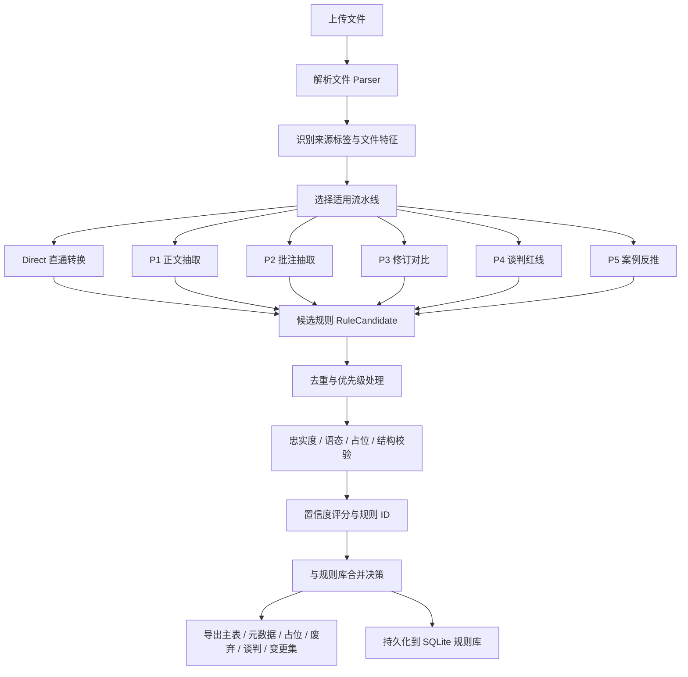
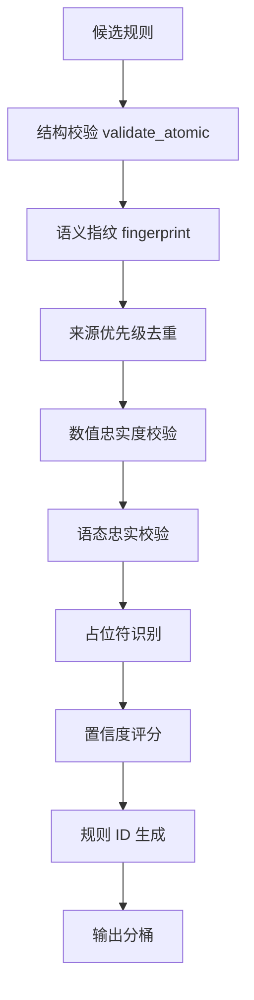

# 规则梳理 Harness：架构实现与规则输出控制指南

> 文档版本：2026-05-28  
> 适用项目：规则梳理工具  
> 试用入口：[https://rule-harness-demo.onrender.com](https://rule-harness-demo.onrender.com)  
> 目标读者：法律、合规、合同管理、法律科技产品同事  

---

## 1. 这份文档解决什么问题

本项目不是一个简单的“把合同文件丢给大模型，然后让模型生成规则”的工具。它的核心是一个 **Rule Extraction Harness**：用一套可配置、可审计、可回放的生产线，把不同来源的法律文本、合同文本、批注、修订、红线、案例材料，转换为可以进入规则库的结构化审查规则。

这份文档重点说明三件事：

1. **项目整体架构如何运转**：从文件上传、解析、分类、流水线抽取，到去重、忠实度校验、导出和入库。
2. **Harness 如何控制规则质量**：哪些规则进入主表，哪些进入占位表、废弃表、谈判表，哪些需要人工复核。
3. **法律同行如何调控输出效果**：想要更保守、更全面、更适合某个行业或合同类型时，应该调哪里，而不是盲目改 prompt。

为了便于法律同行理解，本文尽量少写代码，只保留必要示例。

---

## 2. 一句话理解 Harness

可以把 Harness 理解为：

> 一套围绕“法律规则生产”的工作台。大模型只负责提出候选规则，Harness 负责决定哪些材料应该进入哪个抽取通道、候选规则是否忠实于原文、是否原子化、是否需要降级、是否进入主规则库，以及最终如何导出给法律人审查。

也就是说：

- **Prompt 是发动机之一**，但不是全部。
- **文件标签、流水线、校验门、导出分桶、元数据追踪**共同决定最终效果。
- 真正可用的规则，不是“模型写出来”就结束，而是要经过 Harness 的结构化治理。

---

## 3. 项目的基本工作流

用户视角下，规则梳理工具分为三个主要动作：

1. **上传材料**：合同、制度、审查指引、批注文件、修订文件、红线材料、案例材料、Excel 清单等。
2. **启动任务**：系统识别文件类型和来源标签，调用不同抽取流水线。
3. **查看结果**：在工作台里看抽取进度、规则数量、忠实度拦截、占位规则、废弃规则，并下载结果文件。

系统内部则是如下流程：



---

## 4. 核心概念

### 4.1 文件不是平等的：source_tag 决定基础语境

同一句话来自不同材料，含义和优先级不同。

例如：

| 来源 | 在系统中的含义 | 通常用途 |
|---|---|---|
| 法规 | 最高优先级，偏合规要求 | 提炼硬性合规规则 |
| 公司红线 / 谈判底线 | 企业立场和谈判策略 | 生成谈判红线、可接受底线、不可接受条款 |
| 内部制度 | 公司内部审查要求 | 转换为合同审查规则 |
| 标准条款库 | 参考性模板 | 形成标准条款比对规则 |
| 历史合同 | 经验材料 | 辅助识别常见约定 |
| 案例 / 争议材料 | 反向提炼风险 | 从败诉、争议、裁判观点中形成防范规则 |

默认优先级在 `config.default.yaml` 中配置。通常优先级是：

```yaml
priorities:
  weights:
    法规: 1
    公司红线: 2
    内部制度: 3
    标准条款库: 4
    历史合同: 5
```

数字越小，优先级越高。后续去重时，如果多份材料生成了相似规则，系统会优先保留高优先级来源。

### 4.2 规则不是自然语言段落，而是结构化对象

Harness 处理的核心对象是候选规则 `RuleCandidate`。法律人可以把它理解为一条“待审核的规则草稿”，里面至少包含：

| 字段 | 作用 |
|---|---|
| check_item | 检查项，告诉审核员要看什么 |
| requirement | 审查要求，告诉审核员应当如何判断 |
| notes | 审查说明，解释来源、例外、适用边界 |
| risk_level | 风险等级，高 / 中 / 低 |
| keywords | 检索关键词 |
| source_excerpt | 原文依据 |
| source_tag | 来源类型 |
| theme_key | 主题归类 |
| priority | 来源优先级 |
| output_target | 输出去向：主表、占位、废弃、谈判等 |
| fidelity_pass | 是否通过忠实度校验 |

最终主 CSV 仍保持下游友好的 7 列：

| 列名 | 含义 |
|---|---|
| 规则项id | 稳定规则 ID |
| 是否启用 | 是否进入可用规则 |
| 风险程度 | 高 / 中 / 低 |
| 关键词 | 用于检索和匹配 |
| 检查项 | 审查对象 |
| 审查要求 | 规则判断要求 |
| 审查说明 | 依据、边界、提示 |

其他字段不会塞进主表，而是进入 `metadata.csv` 等辅助文件，供复核和追溯。

### 4.3 Rule ID 不是随便编号

系统会根据规则的核心语义生成指纹，再组合合同类型和规则类型生成规则 ID。

简化理解如下：

```text
合同类型代码 + 规则类型代码 + 语义指纹 = 稳定规则 ID
```

例如：

```text
PUR-C-a1b2c3
```

这让同一条规则在多次运行、增量更新、规则库合并时更容易被识别，而不是每次都变成全新的编号。

### 4.4 theme_key 是规则主题白名单

`theme_keys.yaml` 是一个主题归类白名单，例如付款、保密、知识产权、违约责任、争议解决、合规、交付、质保等。

它的作用不是给界面展示分类这么简单，而是：

- 限制模型乱造主题；
- 帮助相似规则归并；
- 让不同合同类型、不同来源的规则进入统一规则体系；
- 为后续规则库检索、过滤、统计提供稳定维度。

如果新增行业或合同类型，通常应先考虑是否需要扩展 `theme_keys.yaml`，而不是直接在 prompt 里让模型自由发挥。

---

## 5. 六条抽取流水线

Harness 的关键设计是：不同材料走不同流水线，而不是所有内容都交给同一个 prompt。

| 流水线 | 适用材料 | 主要作用 | 输出特点 |
|---|---|---|---|
| Direct | Excel 表格、清单、已结构化规则 | 尽量不重写，直接映射为规则 | 省 token，适合已有规则库迁移 |
| P1 正文抽取 | 普通合同、制度、审查指引正文 | 从正文中拆解原子化规则 | 主力通道 |
| P2 批注抽取 | Word 批注 | 从律师批注、审查意见中形成规则 | 批注通常有较强审查价值 |
| P3 修订对比 | Word 修订痕迹 | 从删除、插入、替换中识别规则 | 可捕捉谈判或审查偏好 |
| P4 谈判红线 | 公司红线、谈判底线材料 | 生成偏谈判场景的规则 | 进入 negotiation 输出 |
| P5 案例反推 | 案例、争议材料、裁判观点 | 从后果反推事前合同审查规则 | 适合风险防范 |

### 5.1 流水线适用性的判断逻辑

Harness 不是把每个文件都送进每条流水线，而是先判断“这个文件适合用什么方式理解”。

判断逻辑可以概括为：

| 判断问题 | 如果答案是 | 系统倾向 |
|---|---|---|
| 文件是否已经是表格化规则或清单 | 是 | 走 Direct，避免模型重写 |
| 文件是否是普通正文材料 | 是 | 走 P1 正文抽取 |
| Word 中是否存在批注 | 是 | 走 P2 批注抽取 |
| Word 中是否存在修订痕迹 | 是 | 走 P3 修订对比 |
| 文件是否被明确标记为公司红线 / 谈判底线 | 是 | 走 P4 谈判红线 |
| 文件是否被明确标记为案例 / 争议材料 | 是 | 走 P5 案例反推 |

这里有两个重要边界：

1. **红线和案例都依赖显式标签**。系统不会仅凭文本里偶然出现“红线”“案例”就随意切换通道，避免误判材料性质。
2. **跳过也是一种判断结果**。如果某条流水线显示“跳过”，通常说明系统认为该文件不具备对应特征，而不是抽取失败。

因此，法律人排查输出质量时，应先看“材料是否进了正确通道”，再看 prompt 或模型效果。

### 5.2 Direct：结构化材料直通

如果输入本身就是 Excel 规则表、检查清单或结构化条目，系统不应强行让模型重写。Direct 通道会尽量保持原始条目，映射为规则对象。

适合场景：

- 已有合同审查清单；
- 律所内部规则库；
- 法务部门历史规则 Excel；
- 人工整理过的风险点表。

### 5.3 P1：正文抽取

P1 是最常用的通道，用于处理合同文本、制度正文、审查指引正文。它的核心任务是把一段法律文本拆成一条或多条“原子规则”。

P1 prompt 中有一个重要决策树：

```text
N = 原文中有几个独立义务 / 禁止 / 要求
M = 原文中有几个独立风险点
K = 原文中有几个独立审查动作
D = 原文中有几个可复用的合同审查判断

RuleCount = max(N, M, K, D)
```

这意味着，系统鼓励从一段复杂文本中拆出多个独立规则，而不是压缩成一条笼统规则。

例如原文：

```text
合同应明确付款节点。付款期限不得超过验收合格后 30 日。
如涉及预付款，应约定预付款返还或抵扣机制。
```

不应只生成一条“付款条款应明确”的泛化规则，而应至少拆成：

| 检查项 | 审查要求 |
|---|---|
| 付款节点约定 | [条款] 合同应明确约定付款节点 |
| 付款期限 | [条款] 付款期限不得超过验收合格后 30 日 |
| 预付款处理 | [条款] 涉及预付款的，应约定返还或抵扣机制 |

P1 的判断逻辑重点是：原文中是否存在可复用的合同审查判断。如果只是背景介绍、章节标题、纯流程描述，P1 可以不输出规则；如果其中含有义务、禁止、条件、风险后果、审查动作，则应拆解为候选规则。

### 5.4 P2：批注抽取

批注往往是律师或法务最真实的审查经验来源。P2 会从 Word 批注中提取规则，特别适合沉淀：

- 律师常见修改意见；
- 法务审查意见；
- 业务部门反馈；
- 某类条款的人工判断口径。

批注类规则通常来源价值较高，因此系统会适当提升它们的优先级。

P2 的判断逻辑重点是：批注是否表达了一个可复用的审查口径。单纯的“同意”“已处理”“格式调整”不应成为规则；包含修改原因、风险提醒、替代条款、审查意见的批注，才更适合转为规则。

### 5.5 P3：修订对比

修订痕迹能反映“原条款为什么不行、改成什么才行”。P3 关注的是删除、插入、替换背后的审查逻辑。

例如：

```text
原文：甲方应在收到发票后付款。
修订：甲方应在收到合法有效发票并验收合格后 30 日内付款。
```

P3 可能提炼出：

| 检查项 | 审查要求 |
|---|---|
| 付款条件 | [条款] 付款条件应同时关联合法有效发票和验收合格 |
| 付款期限 | [条款] 应明确约定付款期限，例如验收合格后 30 日内 |

P3 的判断逻辑重点是：修订前后是否体现了法律风险或商业立场变化。纯错别字、编号、格式修订不应生成规则；把“收到发票后付款”改成“收到合法有效发票并验收合格后付款”，则说明付款条件被强化，可以形成规则。

### 5.6 P4：谈判红线

P4 只应处理明确标记为“公司红线”或“谈判底线”的材料。它不适合普通制度文件，也不适合案例材料。

P4 的输出更像谈判策略，而不是普通审查规则。典型结构包括：

| 层级 | 含义 |
|---|---|
| preferred | 我方优先立场 |
| acceptable | 可接受底线 |
| unacceptable | 不可接受安排 |

因此 P4 的结果默认进入 `negotiation.csv`，避免把谈判策略误混入主规则表。

P4 的判断逻辑重点是：材料是否表达“我方愿意接受到什么程度”。如果只是一般审查要求，不应进入 P4；如果出现“优先方案 / 可接受方案 / 不可接受方案”“底线”“红线”等谈判口径，才适合生成阶梯规则。

### 5.7 P5：案例反推

P5 用于案例、争议材料、裁判观点。它的核心不是总结案件，而是从“发生争议后的结果”反推“签约前应如何审查”。

例如案例材料说：

```text
法院认为，合同未明确约定验收标准，导致双方对交付成果是否合格发生争议。
```

P5 不应输出“本案法院认为……”，而应反推为：

| 检查项 | 审查要求 |
|---|---|
| 验收标准 | [条款] 合同应明确约定交付成果的验收标准、验收流程和不合格处理方式 |

如果材料中没有案号或来源不完整，系统会降低置信度，避免把不完整案例经验当成强规则。

P5 的判断逻辑重点是：案例事实或裁判观点能否转化为“事前可审查动作”。如果只能说明某个案件发生过什么，但无法反推出合同条款应如何约定，就不应强行生成规则。

---

## 6. Harness 内核：从候选规则到可用规则

大模型输出之后，Harness 不会直接信任它，而是继续做一系列“门禁”。



### 6.1 结构校验：防止“看起来像规则，但不能用”

`validate_atomic` 会检查候选规则是否满足基本结构要求，例如：

- 检查项不能过长；
- 审查要求不能过长；
- 审查说明不能过长；
- 检查项不能塞多个并列动作；
- 一条规则不能同时包含多个独立阈值；
- 审查要求应以 `[条款]` 或 `[合规]` 开头；
- `theme_key` 必须在白名单中；
- 风险等级只能是高 / 中 / 低；
- 关键词数量应在合理范围内。

法律上看，这一步是在防止“段落式总结”冒充“审查规则”。

### 6.2 语义指纹：用于去重和稳定编号

系统会根据以下核心字段生成语义指纹：

```text
theme_key | subject | predicate | threshold_type | direction
```

也就是说，真正决定“是否同一条规则”的不是文字表述完全一致，而是审查主题、对象、动作、阈值类型和方向是否一致。

### 6.3 来源优先级去重：同一规则保留更权威来源

如果法规、内部制度、历史合同都抽出了类似规则，系统不会简单全部保留。它会按来源优先级、置信度、规则 ID 等因素选择主规则，并把其他变体记录为辅助信息。

这样做的意义是：

- 避免主表重复；
- 保留来源差异；
- 让法规、红线、制度等高价值来源优先；
- 为人工复核保留冲突线索。

### 6.4 数值忠实度：每一个数字都必须有原文依据

这是本项目最重要的防幻觉机制之一。

规则中的数字包括：

- 天数；
- 比例；
- 金额；
- 倍数；
- 次数；
- 工作日；
- 年、月、日；
- 其他带单位的数字阈值。

Harness 会检查这些数字是否能在原文片段中找到。如果找不到，就说明模型可能编造了阈值。

错误示例：

```text
原文：付款期限由双方根据项目情况协商确定。

错误输出：
[条款] 付款期限不得超过 30 日。
```

这里的 `30 日` 原文没有出现，就不能进入主规则。

正确处理方式可能是：

```text
[条款] 合同应明确约定付款期限，具体期限由双方根据项目情况确定。
```

如果同一条规则出现多个无法 grounding 的数字，系统会把它放入 `discarded.csv`，而不是让它污染主规则库。

### 6.5 语态忠实：不能把建议变成强制

法律材料中经常出现：

- 一般；
- 通常；
- 原则上；
- 可；
- 建议；
- 参考；
- 示例；
- 举例；
- 宜。

这些词说明原文并非绝对强制。Harness 会防止模型把它们升级为：

- 必须；
- 不得；
- 禁止；
- 应当；
- 须。

错误示例：

```text
原文：违约金比例一般可参考合同金额的 3% 至 5%。

错误输出：
[条款] 违约金不得低于合同金额的 3%。
```

问题在于：

1. “一般可参考”被升格成“不得低于”；
2. 示例区间被改造成强制下限；
3. 规则方向发生变化。

更合适的输出是：

```text
[条款] 违约金比例可参考合同金额的 3% 至 5%，并结合交易背景合理约定。
```

### 6.6 占位符识别：把待填写内容从主表里拦出去

很多合同模板或审查指引会出现占位符，例如：

```text
付款期限为 XX 日。
违约金比例为 __%。
合同金额为【】元。
```

这些不是统一审查阈值，而是待经办人填写。系统会识别：

- `XX 天`；
- `XX 月`；
- `__%`；
- `【】`；
- 单独的 `/`；
- 明显的“待填写”“根据项目情况确定”等表达。

这类规则不会进入主 CSV，而是进入 `placeholders.csv`，提醒人工处理。

### 6.7 置信度评分：忠实度权重最高

系统判断一条规则“可信”还是“存疑”，不是只看模型自己说有多确定，而是综合五个门：

```text
综合置信度 =
  自评置信度
+ 一致性置信度
+ 结构校验
+ 冲突情况
+ 忠实度校验
```

五个门分别回答五个不同问题：

| 门 | 问题 | 得分逻辑 | 法律含义 |
|---|---|---|---|
| 自评置信度 | 模型自己认为这条规则把握多大 | 取模型输出的 `self_confidence`，限制在 0-1 | 只能作参考，不能单独决定可信 |
| 一致性 | 换一次抽取是否仍得到相近规则 | 默认等同自评；开启一致性采样时比较语义指纹、数字阈值和方向 | 用来识别“偶然生成”的规则 |
| 结构校验 | 它是否像一条可执行规则 | 通过为 1，失败为 0 | 防止段落总结、复合规则混入 |
| 冲突情况 | 它是否与同主题规则冲突 | 无冲突为 1，有冲突为 0 | 冲突不一定错，但必须提示人工 |
| 忠实度 | 数字和强判断是否有原文依据 | 通过为 1，失败为 0 | 权重最高，用来压制幻觉 |

默认权重中，忠实度最高：

```yaml
confidence:
  weights:
    self: 0.25
    consistency: 0.25
    struct: 0.15
    conflict: 0.05
    fidelity: 0.30
```

这体现了项目原则：

> 少抽一条规则是覆盖不足；错抽一条规则可能会误导审核员。

### 6.8 可信、存疑、不可信是如何判断的

在这个项目里，“可信 / 存疑 / 不可信”不是模型给出的标签，而是 Harness 根据多个证据综合判断的结果。

可以按三层理解。

#### 6.8.1 可信规则

一条规则通常可以被视为“可信候选”，需要同时满足：

| 条件 | 判断逻辑 |
|---|---|
| 有明确原文依据 | `source_excerpt` 中能找到对应义务、禁止、条件、风险或裁判观点 |
| 结构通过 | 检查项、审查要求、风险等级、关键词、theme_key 等字段符合规则格式 |
| 数字忠实 | 规则中的数字、比例、期限、金额能在原文中找到 |
| 语态一致 | 原文是强义务，规则才使用强义务；原文是建议，规则保留弱语态 |
| 非占位 | 不是 `XX 天`、`__%`、`【】` 等待填写内容 |
| 无明显冲突 | 与同主题其他规则不存在阈值冲突或跨来源冲突 |
| 综合置信度达标 | 默认不低于 `threshold_review: 0.7` |

这类规则通常进入 `main.csv`，并在 `metadata.csv` 中保留来源和置信度信息。

#### 6.8.2 存疑规则

“存疑”并不等于错误，而是说明它需要人工看一眼。常见触发信号包括：

| 存疑信号 | 系统如何判断 | 为什么需要人工复核 |
|---|---|---|
| 综合置信度低于 0.7 | `combined_confidence < threshold_review` | 可能结构、冲突或忠实度某项扣分 |
| 结构校验失败 | `struct_check_pass = false` | 可能是一条复合规则、过长规则或字段不规范 |
| 有冲突标记 | `conflict_flag` 为阈值冲突或跨源冲突 | 可能不同来源对同一问题口径不同 |
| 语态不匹配 | `voice_match = false` | 模型可能把建议升格成强制 |
| 自评过低 | `self_confidence < 0.4` | 当前实现会倾向把它识别为占位或弱规则 |
| 案例来源不足 | 案例缺少案号、裁判观点或可反推动作 | 不能直接作为强审查规则 |

存疑规则的处理方式取决于问题类型：

- 如果只是综合置信度略低，但原文依据清楚，可以人工确认后保留；
- 如果是跨来源冲突，应比较法规、红线、内部制度和历史合同的优先级；
- 如果是语态不匹配，应改写为弱语态或从主表移出；
- 如果是占位或低自评，通常进入 `placeholders.csv`，等待人工补充。

#### 6.8.3 不可信规则

一条规则通常会被视为“不可信”或“不应入主表”，如果出现：

| 问题 | 系统动作 |
|---|---|
| 两个及以上数字无法在原文中 grounding | `output_target = discarded` |
| 原文明显是占位符，规则却给出具体阈值 | `output_target = placeholder` 或拦截 |
| 规则主题不在白名单且结构不合格 | 结构校验失败，置信度下降 |
| 把软语态严重升格为强制义务 | 记录 `voice_match = false`，人工复核 |
| 只是标题、背景、说明，无法形成审查动作 | 不应生成规则，或生成后被低置信处理 |

这里最严格的是数值忠实度。当前实现中，如果一条规则有两个及以上未能 grounding 的数字 token，会直接进入 `discarded.csv`，不会进入主规则表。

#### 6.8.4 一个完整判断例子

原文：

```text
违约金比例一般可参考合同金额的 3% 至 5%，具体由双方协商确定。
```

候选规则 A：

```text
[条款] 违约金不得低于合同金额的 3%。
```

Harness 判断：

| 检查项 | 结果 | 原因 |
|---|---|---|
| 数字忠实 | 通过 | 3% 原文出现 |
| 语态忠实 | 不通过 | “一般可参考”被写成“不得低于” |
| 结构校验 | 可能通过 | 形式上像规则 |
| 冲突 | 暂无 | 单条无法判断冲突 |
| 综合置信度 | 下降 | 语态问题导致人工复核必要 |
| 输出建议 | 不应直接入主表 | 应改为弱语态 |

更好的规则：

```text
[条款] 违约金比例可参考合同金额的 3% 至 5%，并结合交易背景由双方合理约定。
```

这个例子说明：数字出现过，不代表规则一定可信；还要看语态、方向和法律含义是否忠实。

---

## 7. 输出分桶：为什么不是所有结果都进主表

Harness 最终会把规则分到不同出口。

| 输出 | 文件 | 含义 |
|---|---|---|
| 主规则 | `main.csv` | 可进入规则库的核心规则 |
| 元数据 | `metadata.csv` | 来源、置信度、忠实度、输出去向等审计信息 |
| 占位规则 | `placeholders.csv` | 原文是待填写、示例值、非统一阈值 |
| 废弃规则 | `discarded.csv` | 忠实度失败严重、结构不可用等 |
| 谈判规则 | `negotiation.csv` | 红线 / 底线 / 谈判策略类规则 |
| 冲突报告 | `conflict_report.html` | 同主题规则存在来源或要求冲突 |
| 变更集 | `change_set.csv` | 与已有规则库合并后的新增 / 更新记录 |
| 摘要 | `summary.html` | 本批次总体统计 |

这个分桶设计非常重要。它避免了两个常见问题：

1. **把所有模型输出都塞进主规则表**，导致规则库快速污染；
2. **把有价值但未成熟的结果直接丢掉**，导致法律人无法复核。

### 7.1 分桶的具体判断顺序

当前实现中，分桶不是并列随便选，而是按优先级判断：

| 判断顺序 | 条件 | 去向 | 解释 |
|---|---|---|---|
| 1 | 忠实度失败 token 数量大于等于 2 | `discarded.csv` | 数值幻觉风险过高，不进主表 |
| 2 | 是占位规则 | `placeholders.csv` | 原文是待填写、无具体内容或低自评，不应当成正式规则 |
| 3 | 原本由 P4 标记为谈判规则 | `negotiation.csv` | 谈判底线和普通审查规则分开 |
| 4 | 以上都不是 | `main.csv` | 可作为主规则候选 |

这里要注意：“进入主表”仍然不等于“无需律师确认”。主表的含义是：它通过了自动化门禁，适合作为规则库候选；正式入库前仍建议抽样或逐条复核，尤其是高风险规则。

### 7.2 metadata 如何呈现判断证据

`metadata.csv` 的作用是解释“系统为什么这么判断”。重点字段包括：

| 字段 | 能回答的问题 |
|---|---|
| 模型自评置信度 | 模型自己认为把握多大 |
| 结构校验通过 | 规则格式是否合格 |
| 冲突标记 | 是否存在阈值冲突或跨来源冲突 |
| 综合置信度 | 五个门综合之后是否低于复核阈值 |
| 忠实度通过 | 数字和阈值是否有原文依据 |
| 忠实度失败项 | 哪些 token 没找到原文依据 |
| 语态匹配 | 是否把软语态升格为强义务 |
| 输出目标 | 最终进入 main / placeholder / discarded / negotiation 哪一类 |
| 原文片段 | 人工复核时回到依据 |

所以，法律人判断一条规则时，不应只看“审查要求”写得好不好，还应同时看这些证据字段。

### 7.3 冲突判断逻辑

系统会先用语义指纹把相似规则归到一组，再看同组内是否有冲突。

主要有两类：

| 冲突类型 | 判断方式 | 例子 |
|---|---|---|
| 阈值冲突 | 同一主题、同一方向，但数字阈值不同 | 一个来源说 30 日，另一个来源说 60 日 |
| 跨源冲突 | 相似规则来自不同 source_tag | 法规、内部制度、历史合同对同一问题口径不同 |

冲突并不代表规则错误。它的含义是：

- 需要比较来源优先级；
- 需要看是否存在适用场景差异；
- 需要法律人决定保留哪个口径；
- 可能需要拆分为不同合同类型或不同业务场景的规则。

---

## 8. 如何控制规则输出效果

这一节是给法律同行和项目配置人员看的。多数输出问题，不一定要改代码，通常先从以下层面控制。

### 8.1 第一层：控制输入材料的来源标签

上传材料时，来源标签非常关键。

| 你想达到的效果 | 推荐做法 |
|---|---|
| 生成普通审查规则 | 标记为内部制度、标准条款库、历史合同等 |
| 生成更强的合规规则 | 标记为法规，并确认材料确为有效规范 |
| 生成谈判底线 | 标记为公司红线 / 谈判底线 |
| 从败诉或争议中反推规则 | 标记为案例 / 争议材料 |
| 转换已有规则表 | 使用 Excel / 清单形式，让 Direct 通道处理 |

如果来源标签错了，后续 prompt 再好也会偏。

例如，把案例材料当成普通制度，系统可能过度抽象；把红线材料当成普通合同，系统可能把谈判底线误认为一般规则。

### 8.2 第二层：控制合同类型、行业和适用场景

同一个规则在不同合同类型中可能完全不同。

例如：

- 采购合同关注付款、验收、质量、违约；
- 租赁合同关注租期、租金、交付、装修、解除；
- SaaS 合同关注服务可用性、数据安全、知识产权、责任限制；
- 工程合同关注工期、变更、签证、结算、质保。

因此在正式使用中，应尽量提供：

- 合同类型；
- 行业；
- 适用地域；
- 我方立场；
- 是否偏甲方 / 乙方；
- 是否面向内部审查还是对外谈判。

这些信息会影响规则解释和风险等级。

### 8.3 第三层：控制颗粒度

默认配置中，抽取颗粒度偏细：

```yaml
extraction:
  granularity: fine
  regulation_depth: full
```

适合目标：

- 希望规则尽量拆细；
- 用于建设规则库；
- 用于后续自动审查；
- 需要高覆盖率。

如果只是快速浏览材料，可以考虑降低颗粒度。但对于规则库建设，不建议过早压缩颗粒度，因为压缩会让多个审查点混在一起，不利于后续自动匹配。

### 8.4 第四层：控制主题白名单

如果发现模型总是把某类规则归错类，不一定是模型能力问题，可能是 `theme_keys.yaml` 没有覆盖该业务主题。

例如新增一个“AI 服务合同”场景，可能需要增加：

- model_output_liability；
- training_data_rights；
- hallucination_liability；
- data_retention；
- service_availability；
- prompt_confidentiality。

主题扩展应保持克制。建议原则是：

1. 只有当现有主题确实无法容纳时才新增；
2. 新主题要能被多个规则复用；
3. 不要把一次性条款名当成 theme_key；
4. 新增后用一批样本验证归类稳定性。

### 8.5 第五层：控制 prompt 中的“拆解规则”

P1 的核心不是“多写一点”，而是“按法律审查动作拆解”。

如果输出太粗，可以检查 prompt 是否强调：

- 一个义务一条规则；
- 一个禁止一条规则；
- 一个阈值一条规则；
- 一个主体一条规则；
- 一个风险后果一条规则；
- 一个审查动作一条规则。

错误拆法：

```text
检查项：付款条款
审查要求：[条款] 合同应明确付款节点、付款条件、付款期限、发票要求、验收条件和逾期责任。
```

更好的拆法：

| 检查项 | 审查要求 |
|---|---|
| 付款节点 | [条款] 合同应明确约定各付款节点 |
| 付款条件 | [条款] 付款条件应与验收、发票或交付成果挂钩 |
| 付款期限 | [条款] 合同应明确约定每一付款节点对应的付款期限 |
| 发票要求 | [条款] 如付款以发票为前提，应明确发票类型和开具要求 |
| 逾期付款责任 | [条款] 合同应明确约定逾期付款责任 |

### 8.6 第六层：控制忠实度阈值

如果目标是给客户试用、展示能力，可以保持默认配置。

如果目标是导入正式规则库，建议更保守：

- 提高人工复核阈值；
- 重点检查 `metadata.csv` 中忠实度失败记录；
- 不把 `placeholders.csv` 直接并入主库；
- 不把 `discarded.csv` 恢复为主规则，除非人工确认；
- 对高风险规则逐条查看原文依据。

### 8.7 第七层：控制红线和谈判输出

红线材料不要和普通制度材料混传，除非明确区分 source_tag。

正确方式：

| 材料 | 标签 |
|---|---|
| 公司不可接受条款清单 | 公司红线 / 谈判底线 |
| 合同审核操作手册 | 内部制度 |
| 法律法规条文 | 法规 |
| 败诉案例复盘 | 案例 / 争议材料 |

这样 P4 只处理真正的谈判材料，结果进入 `negotiation.csv`，不会污染主表。

---

## 9. 如何阅读一次任务的输出

一次完整任务结束后，不建议只看 `main.csv`。推荐顺序如下。

### 9.1 先看 summary

关注：

- 总共处理了多少文件；
- 每条流水线是否运行；
- 每条流水线产出了多少规则；
- 有多少规则被忠实度拦截；
- 有多少占位规则；
- 有多少废弃规则；
- token 使用量是否异常。

如果 P1 显示 0%，通常应先看进度和后端任务状态；如果 P1 完成但主表很少，应继续看占位和废弃桶。

### 9.2 再看 main.csv

主表是最终可用规则，但仍建议抽样检查：

- 检查项是否足够原子；
- 审查要求是否能直接用于审查；
- 数字阈值是否来自原文；
- 风险等级是否合理；
- 关键词是否便于检索；
- 审查说明是否包含必要边界。

判断主表规则时，可以按“六问法”快速复核：

| 问题 | 如果答案是否定的 |
|---|---|
| 原文中是否确实有这个审查点 | 可能是模型过度推断 |
| 数字、期限、比例是否都来自原文 | 可能是数值幻觉 |
| 语气是否与原文一致 | 可能把建议升格为强制 |
| 是否只表达一个审查动作 | 可能需要拆分 |
| 是否适用于当前合同类型 | 可能需要限定适用范围 |
| 是否和其他来源冲突 | 需要查看 conflict_report |

### 9.3 必看 metadata.csv

`metadata.csv` 是审计入口。它能帮助回答：

- 这条规则来自哪个文件；
- 来源标签是什么；
- 是否通过忠实度；
- 是否发生语态不匹配；
- 输出目标是什么；
- 置信度是多少；
- 是否有冲突标记。

法律团队真正复核规则库时，`metadata.csv` 往往比主表更重要。

推荐把 `combined_confidence` 分成三档理解：

| 分数区间 | 含义 | 建议动作 |
|---|---|---|
| 0.85 以上 | 自动证据较充分 | 抽样复核即可，重大规则仍需看原文 |
| 0.70 - 0.85 | 基本可用但仍需关注 | 看忠实度、语态、冲突字段 |
| 0.70 以下 | 存疑 | 逐条人工复核，不建议直接入库 |

这个分档是使用建议，不是硬性法律结论。真正的判断仍要结合原文、来源优先级和业务场景。

### 9.4 检查 placeholders.csv

占位规则不一定是坏结果。它们通常说明原文确实没有统一阈值，需要业务人员或合同经办人填写。

例如：

```text
付款期限为 XX 日。
```

系统不应该替你生成 `30 日`。它应该把这类内容放进占位表。

### 9.5 检查 discarded.csv

废弃规则用于诊断质量问题。常见原因：

- 模型编造了多个数字；
- 原文没有足够依据；
- 结构不符合规则要求；
- 主题不在白名单；
- 语态升格严重。

如果废弃数量异常高，不要立刻降低校验标准。应先检查：

1. 文件是否解析正常；
2. 来源标签是否正确；
3. 原文是否本身就是说明性文字；
4. prompt 是否过度要求输出；
5. theme_key 是否覆盖该业务场景。

### 9.6 检查 negotiation.csv

如果上传了红线或谈判底线材料，应重点看 `negotiation.csv`，而不是只看主表。

这类输出更适合用于谈判策略库、条款替代方案库、风险底线说明，不一定适合直接作为普通审查规则。

---

## 10. 规则输出效果的常见调参场景

### 10.1 想要“更少幻觉”

优先做：

1. 保持忠实度权重最高；
2. 提高人工复核阈值；
3. 严格禁止未 grounding 数字进入主表；
4. 增加软语态反例；
5. 查看 `discarded.csv`，不要把废弃规则直接恢复。

不建议：

- 只在 prompt 里写“不要幻觉”；
- 降低忠实度门；
- 把占位规则混入主表。

### 10.2 想要“覆盖更多规则”

优先做：

1. 确认 P1 / P5 是否实际运行；
2. 检查文件是否被错误识别为跳过；
3. 检查正文是否被切成足够的 blocks；
4. 使用 fine granularity；
5. 强化 prompt 中 N/M/K/D 决策树；
6. 查看 `placeholder` 和 `discarded`，确认不是规则被分流了。

注意：覆盖率提升不能以牺牲忠实度为代价。应先确认规则是否被错误分流，而不是直接放松校验。

### 10.3 想要“更适合某个行业”

优先做：

1. 建立行业 profile；
2. 扩展必要的 theme_key；
3. 加入行业常用术语；
4. 补充行业 few-shot；
5. 用同一批样本反复比较输出差异。

例如地产、工程、采购、SaaS、数据合规、劳动用工等行业，规则主题和风险等级都可能不同。

### 10.4 想要“更适合法律人复核”

优先做：

1. 保持主表简洁；
2. 在 metadata 中保留来源和校验信息；
3. 使用 conflict_report 查看冲突；
4. 用 placeholders 收集待人工判断项；
5. 用 discarded 反查模型失败原因。

法律人复核不需要看模型所有中间推理，但必须能看到：

- 原文依据；
- 为什么这条进主表；
- 为什么那条被拦截；
- 同类规则是否有冲突。

### 10.5 想要“给客户一键试用”

当前 Render 部署适合演示和测试客户试用：

```text
https://rule-harness-demo.onrender.com
```

注意事项：

- 免费服务可能有冷启动；
- 演示环境不应视为正式生产库；
- 客户上传材料前应确认脱敏要求；
- API key、模型、并发和预算应由配置控制；
- 对外展示时建议准备小样本文档，避免客户第一次就上传超大材料。

---

## 11. 与普通“大模型抽取”的区别

| 维度 | 普通大模型抽取 | 本项目 Harness |
|---|---|---|
| 输入处理 | 直接把文本给模型 | 先解析、分类、分块、识别来源 |
| 抽取方式 | 一个 prompt 处理所有内容 | P1-P5 + Direct 分通道处理 |
| 规则质量 | 依赖模型自觉 | 结构校验、忠实度、语态、占位、去重、置信度 |
| 数字阈值 | 容易编造 | 必须能在原文 grounding |
| 输出结果 | 一份结果表 | 主表、元数据、占位、废弃、谈判、冲突、变更集 |
| 可审计性 | 较弱 | 每条规则保留来源、状态、校验结果 |
| 规则库合并 | 常需人工处理 | 通过 ID、指纹、优先级和 merge decision 支持增量 |

---

## 12. 推荐的法律团队使用路径

### 第一步：用小样本跑通

准备 3 到 5 份材料：

- 一份普通合同或审查指引；
- 一份带批注的 Word；
- 一份红线材料；
- 一份案例或争议复盘；
- 一份已有规则 Excel。

每类材料先单独跑一次，观察各自输出。

### 第二步：建立自己的来源标签规范

法律团队内部应统一：

- 什么叫法规；
- 什么叫内部制度；
- 什么叫公司红线；
- 什么叫案例材料；
- 什么材料只能作参考，不能直接进主库。

来源标签不统一，规则库会很快混乱。

### 第三步：建立主题白名单

从现有 `theme_keys.yaml` 开始，逐步扩展，而不是一次性设计一个庞大分类体系。

建议每新增一个主题，都回答：

1. 它是否会被反复使用；
2. 它是否和现有主题明显不同；
3. 它是否有稳定的法律含义；
4. 它是否能帮助后续检索和合并。

### 第四步：对比 main / placeholder / discarded

不要只追求 main.csv 数量。一次好的抽取，可能会产生不少 placeholder 和 discarded，因为系统正在主动拦截不适合入库的内容。

推荐复核表：

| 检查项 | 问题 |
|---|---|
| main.csv | 是否可直接进入规则库 |
| metadata.csv | 是否能追溯来源和校验状态 |
| placeholders.csv | 是否确属待填写或示例 |
| discarded.csv | 是否存在被误杀的高价值规则 |
| negotiation.csv | 是否应进入谈判策略库而非主库 |

### 第五步：形成行业 profile

当一个团队开始反复处理同一类合同时，就应该沉淀行业 profile，包括：

- 合同类型；
- 常见风险；
- 常见条款；
- 常用关键词；
- 高风险红线；
- 常见案例后果；
- 输出偏好。

这比每次临时改 prompt 更稳定。

---

## 13. 典型示例

### 示例 1：正确拆解复合条款

原文：

```text
供应商应在交付前提供产品合格证明。产品存在质量问题的，采购方有权拒收；
因此造成采购方损失的，供应商应承担赔偿责任。
```

较好的输出：

| 检查项 | 审查要求 | 风险 |
|---|---|---|
| 产品合格证明 | [条款] 供应商应在交付前提供产品合格证明 | 中 |
| 质量问题拒收权 | [条款] 产品存在质量问题的，采购方应有权拒收 | 高 |
| 质量损失赔偿 | [条款] 因产品质量问题造成采购方损失的，供应商应承担赔偿责任 | 高 |

这体现了原子化：一个审查动作一条规则。

### 示例 2：占位值不能编造成统一阈值

原文：

```text
付款期限为 XX 日，具体以项目审批结果为准。
```

错误输出：

```text
[条款] 付款期限不得超过 30 日。
```

正确输出：

```text
[条款] 本项按经办人据实填写，无统一阈值。
```

输出去向：`placeholders.csv`。

### 示例 3：软语态不能升格

原文：

```text
违约金比例一般可参考合同金额的 3% 至 5%。
```

错误输出：

```text
[条款] 违约金不得低于合同金额的 3%。
```

正确输出：

```text
[条款] 违约金比例可参考合同金额的 3% 至 5%，并结合交易背景合理约定。
```

关键点：保留“可参考”的弱语态。

### 示例 4：案例反推不是案件摘要

案例原文：

```text
法院认为，双方未约定验收标准，导致无法判断交付成果是否符合合同目的。
```

错误输出：

```text
法院认为双方未约定验收标准导致争议。
```

正确输出：

```text
[条款] 合同应明确约定交付成果的验收标准、验收流程及不合格处理方式。
```

关键点：P5 要把事后争议转化为事前审查规则。

---

## 14. 常见问题与排查

### 14.1 为什么主表规则很少？

先不要急着改 prompt。按顺序检查：

1. 文件是否解析成功；
2. P1 / P5 / Direct 等流水线是否实际运行；
3. 是否大量规则进入 `placeholders.csv`；
4. 是否大量规则进入 `discarded.csv`；
5. `metadata.csv` 中是否有忠实度失败；
6. 来源标签是否导致某些流水线跳过；
7. theme_key 白名单是否过窄。

### 14.2 为什么进度显示有规则，但 main.csv 很少？

因为候选规则不等于主表规则。候选规则可能被分流到：

- 占位；
- 废弃；
- 谈判；
- 低置信度复核；
- 冲突变体。

这通常不是 bug，而是质量控制在发挥作用。

### 14.3 为什么案例材料抽不出很多规则？

可能原因：

- 材料没有被标记为案例 / 争议材料；
- 案例文本缺少裁判观点或争议焦点；
- P5 因缺少案号或来源降低了置信度；
- 案例只是事实叙述，缺少可反推的审查规则。

### 14.4 为什么红线没有出现在主表？

红线材料通常进入 `negotiation.csv`，而不是 `main.csv`。这是为了避免把谈判策略和普通审查规则混在一起。

### 14.5 为什么系统不自动补一个合理数字？

因为本项目的原则是忠实度优先。对于法律审查规则，编造一个“看似合理”的数字，比少生成一条规则更危险。

---

## 15. 当前实现中的主要文件

| 文件 | 作用 |
|---|---|
| `backend/orchestrator.py` | 批任务总编排：解析、流水线、去重、校验、导出、持久化 |
| `backend/pipelines/` | P1-P5 和 Direct 抽取流水线 |
| `backend/prompts/` | 各流水线使用的 prompt |
| `backend/harness.py` | 原子规则校验、指纹、规则 ID |
| `backend/fidelity.py` | 数值忠实度校验 |
| `backend/voice_check.py` | 语态忠实校验 |
| `backend/placeholder_detector.py` | 占位符识别 |
| `backend/confidence.py` | 综合置信度评分 |
| `backend/dedupe.py` | 规则去重和优先级处理 |
| `backend/exporter.py` | 主表、元数据、占位、废弃、谈判、摘要等导出 |
| `config.default.yaml` | 默认模型、并发、优先级、置信度权重等 |
| `theme_keys.yaml` | 规则主题白名单 |

---

## 16. 设计边界

### 16.1 Harness 辅助法律人，不替代法律判断

系统可以帮助法律团队快速沉淀规则，但不应替代专业律师或法务的最终判断。尤其是：

- 高风险规则；
- 涉及强制性法律后果的规则；
- 涉及金额、期限、比例的规则；
- 从案例反推的规则；
- 与企业商业立场有关的红线规则。

这些都应经过人工复核。

### 16.2 演示环境不等于生产环境

当前 Render 链接适合体验完整流程，但正式生产应考虑：

- 数据持久化；
- 文件保密；
- 权限控制；
- 任务隔离；
- 日志脱敏；
- API key 管理；
- 客户数据删除机制。

### 16.3 不要把所有规则都追求“自动入库”

一个成熟的规则生产流程，应允许：

- 自动进入主库；
- 进入人工复核；
- 进入占位处理；
- 进入废弃留痕；
- 进入谈判策略库；
- 进入行业 profile 后续优化。

如果所有结果都直接进主库，短期看数量很好，长期看规则库会不可维护。

---

## 17. 最佳实践总结

1. **先管输入，再管输出**：来源标签、合同类型、行业信息比一句“请准确抽取”更重要。
2. **忠实度优先于覆盖率**：宁可少一条，也不要编一条。
3. **主表只放成熟规则**：占位、废弃、谈判都应该分开。
4. **metadata 是审计核心**：法律团队复核时不要只看 main.csv。
5. **案例要反推审查动作**：不要把 P5 做成案件摘要器。
6. **红线要独立治理**：谈判底线不是普通合同规则。
7. **theme_key 要克制扩展**：分类稳定比分类数量更重要。
8. **低产出先查分桶和流水线**：不要一上来就改 prompt。
9. **行业化靠 profile 沉淀**：不要每次临时调模型。
10. **Harness 的价值在治理链条**：模型负责提出，系统负责校验，法律人负责确认。

---

## 18. 一页版流程备忘

```text
文件上传
  ↓
解析 DOCX / PDF / XLSX / TXT
  ↓
根据 source_tag 和文件特征选择 Direct / P1 / P2 / P3 / P4 / P5
  ↓
大模型生成候选规则
  ↓
结构校验：是否像一条可用规则
  ↓
忠实度校验：数字和强义务是否有原文依据
  ↓
语态校验：建议不能升格为强制
  ↓
占位识别：XX / __% / 【】 不进主表
  ↓
去重：同类规则保留更权威来源
  ↓
置信度评分：忠实度权重最高
  ↓
规则 ID：稳定编号，便于增量合并
  ↓
导出：
  - main.csv
  - metadata.csv
  - placeholders.csv
  - discarded.csv
  - negotiation.csv
  - conflict_report.html
  - change_set.csv
  - summary.html
```

---

## 19. 后续可继续完善的方向

后续如果要把 Harness 进一步产品化，建议优先考虑：

1. **行业 profile 管理界面**：让法律人维护行业词表、主题、红线，而不是改配置文件。
2. **规则复核工作台**：支持逐条查看原文、候选规则、忠实度失败原因和人工确认结果。
3. **规则版本管理**：同一规则在不同批次中的变化应可追踪。
4. **客户隔离与权限**：试用客户、内部用户、管理员应有不同权限边界。
5. **样本评测集**：为常见合同类型建立人工标注样本，用于比较版本效果。
6. **导入目标系统适配**：根据不同合同审查系统的字段要求生成不同导出模板。

---

## 20. 结语

规则梳理 Harness 的核心价值，不是让大模型“写更多规则”，而是让法律规则生产变得可控：输入可分类、过程可观察、候选可校验、结果可分桶、来源可追溯、规则库可增量维护。

对于法律同行来说，最重要的使用心法是：

> 不要只问“模型抽得准不准”，而要看这套 Harness 是否把错误规则拦住、把不成熟规则分流、把可用规则留下，并且让每一条规则都能回到原文和业务语境中。
